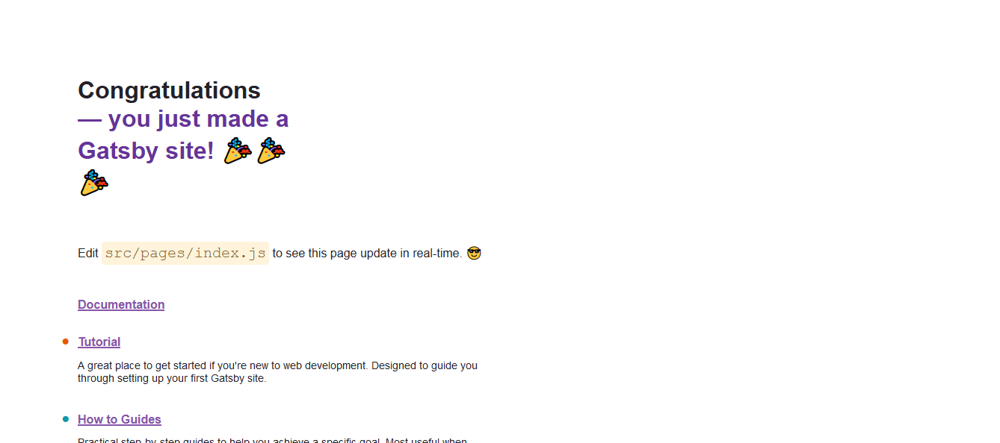
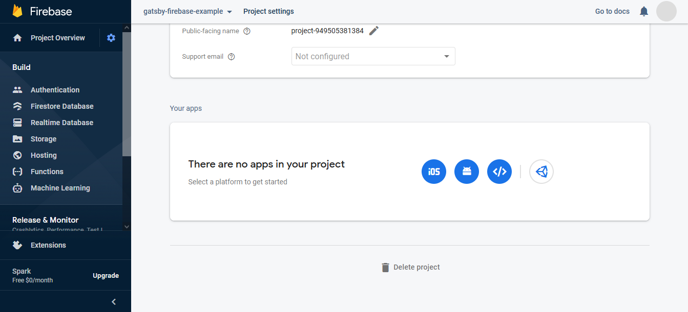
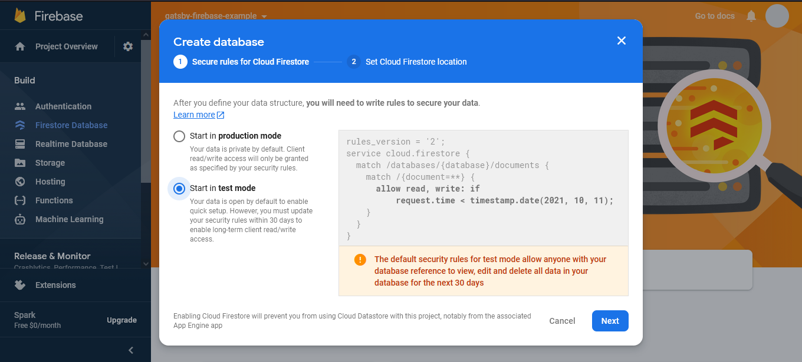
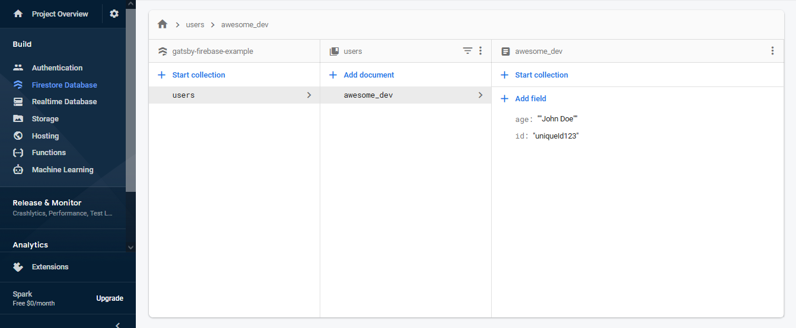
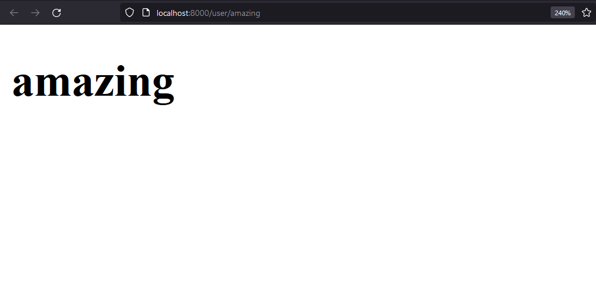
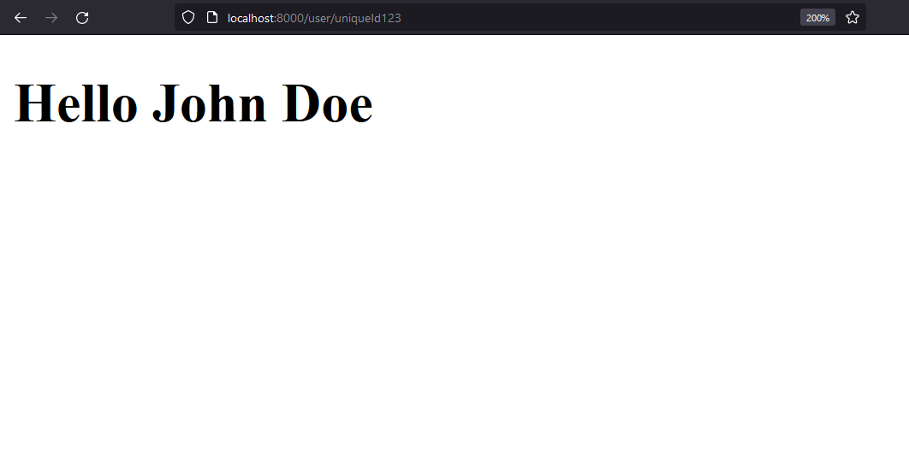

# Introduction

While working on a social media project using Gatsby, I needed a way to authenticate users, save their information, and create a custom link in which you could read their data, so I decided to use Firebase's database for the job.

Gatsby is a Static Site Generator for React, meaning that it converts the data from external sources into HTML-based webpages to avoid server-side processing when accessing a website.

On the other side, Firebase is a development platform for web and mobile apps created by Google. It has several products, like Cloud Storage, Machine Learning, and Hosting, but we will focus on Firebase's Firestore. According to [Firebase](https://firebase.google.com/docs/firestore), Firestore is "a flexible, scalable database for mobile, web, and server development from Firebase and Google Cloud."

## The problem with Gatsby and Firebase

In most cases, you can easily add external data to your Gatsby project with a plugin from the [Gatsby Plugin Library](https://www.gatsbyjs.com/plugins), then generate your static files, and redeploy your page to see the changes. However, in my case, I needed to create pages on demand based on new users. I could do this by listening to a change in my database and then rebuild and redeploy my Gatsby project. But as you may notice, this process is problematic in terms of performance since building and deploying Gatsby over and over is computationally expensive and time-consuming.

## What can I do?

To achieve our previous goals, we will be using Gatsby's  [File System Route API](https://www.gatsbyjs.com/docs/reference/routing/file-system-route-api/) to create a Client Only Route and access the parameters from its URL to fetch each user's data from Firestore. It sounds cumbersome at first, but it is a surprisingly straightforward approach.

# The gist

## 1. Start a new Gatsby Project

To begin, you will need to initialize a new [Gatsby project](https://www.gatsbyjs.com/docs/quick-start/) with the following command:

```sh
$ npm init gatsby 
```

Then follow the prompts to choose your preferred CMS, styling tools, and additional features, and once finished, go to the new directory:

```sh
$ cd my-gatsby-site
```

Lastly, start the local development server with the command:

```sh
$ npm run develop
```

Great! Now you can navigate to [localhost:8000](http://localhost:8000/user/amazing) and see your Gatsby site.



## 2. Create a Firebase Project

The next step is to [add a new firebase project](https://firebase.google.com/docs/web/setup) in the [Firebase Console](https://console.firebase.google.com/) 


After clicking on "Add project" and adding a name, Firebase will create your new project and redirect you to the project overview. There you can access the project settings and register a new web app.



After giving it a name, Firebase will give you your app configuration, which will look like this:

```javascript
const firebaseConfig =  {
    apiKey:  "API_KEY",
    authDomain:  "AUTH_DOMAIN.firebaseapp.com",
    projectId:  "gatsby-firebase-example",
    storageBucket:  "STORAGEBUCKET.appspot.com",
    messagingSenderId:  "MESSAGING_SENDE_RID",
    appId:  "APP:web:ID" 
};
```

Then you can [add Firestore](https://firebase.google.com/docs/firestore/quickstart) to your project in "Test mode"



To make this tutorial simpler, we will manually create some data on Firestore to read it later from Gatsby. We will create a collection called "users" and a document called "awesome_dev" with a "name" and "id" field :



Back to your Gatsby code, install Firebase in your project's root:

```sh
$ npm install firebase@9.0.2  --save
```

## 3. Create a Client Only Route

Once Firebase is installed, go to your ./src/pages and create a /user directory with a file inside called \[id].js . In Gatsby, the square braces around a page file path mark any dynamic segments of the URL that you can access inside your components.

Note: after creating a new page file, you may need to restart the development server.

Inside the \[id].js file, create a simple component with an id prop:

```jsx
// ./src/pages/user/[id].js

import * as React from "react";

    const UserPage = ({id}) => {
			return <h1>{id}</h1>
		};
export default UserPage; 
```

And if we go to [localhost:8000/user/amazing](http://localhost:8000/user/amazing) you will see the following:



Now you can use the URL id to access data from Firestore! 

## 4. Access Firestore data

Firstly, you will need to initialize your [Firebase App](https://firebase.google.com/docs/web/setup#add-sdk-and-initialize) inside Gatsby:

```jsx
// ./src/pages/user/[id].js

import { initializeApp } from 'firebase/app';

// Your web app's Firebase configuration
const firebaseConfig =  {
	//... 
};

// Initialize Firebase
const app = initializeApp(firebaseConfig);

const UserPage = ({id}) => {
	return <h1>{id}</h1>;
	
};

export default UserPage;
```

Note: you would preferably initialize your app inside a context, and then add it to your [wrapRootElement](https://www.gatsbyjs.com/docs/reference/config-files/gatsby-browser/#wrapRootElement) function to execute it on all pages.

Then import firestore from firebase and create a reference to your users collection:

```jsx
// ./src/pages/user/[id].js

import * as React from "react";
import { initializeApp } from "firebase/app";
import { getFirestore, collection } from "firebase/firestore";


// Your web app's Firebase configuration
const firebaseConfig =  {
	//... 
};

// Initialize Firebase
const app = initializeApp(firebaseConfig);

const UserPage = ({id}) => {
	const db = getFirestore();
	const usersRef = collection(db, "users");


	return <h1>{id}</h1>;
};

export default UserPage;
```

Now we need to create a query for the users' collection that looks for a user with the same id as the URL id. To achieve this, we will be importing the query module from Firestore with a couple more functions. Then we will execute the query inside a useEffect.

```jsx
// ./src/pages/user/[id].js

import * as React from "react";
import {useEffect} from "react";
import {initializeApp} from "firebase/app";
import {getFirestore, collection, query, where, getDocs} from "firebase/firestore";

// Your web app's Firebase configuration
const firebaseConfig =  {
	//... 
};

// Initialize Firebase
const app = initializeApp(firebaseConfig);

const UserPage = ({id}) => {

	const db = getFirestore();
	const usersRef = collection(db, "users");

	useEffect(() => {
		const queryUser = async () => {

			const usersQuery = query(usersRef, where("id", "==", id));
			const usersQuerySnap = await getDocs(usersQuery);

			usersQuerySnap.forEach((user) => {});
		};

		queryUser();

		// eslint-disable-next-line react-hooks/exhaustive-deps
	}, []);

	return <h1>{id}</h1>;
};

export default UserPage;
```

Note: you will need to iterate the query snap since it normally queries several documents. Since the id is supposedly unique, it will query just one.

Now we can create a state that will have the user data, and then conditional render it to your website!

```jsx
// ./src/pages/user/[id].js

import * as React from "react";
import {useEffect, useState} from "react";
import {initializeApp} from "firebase/app";
import {getFirestore, collection, query, where, getDocs} from "firebase/firestore";

// Your web app's Firebase configuration
const firebaseConfig = {
	/...
};

// Initialize Firebase
const app = initializeApp(firebaseConfig);

const UserPage = ({id}) => {
	const [userData, setUserData] = useState(null);

	const db = getFirestore();
	const usersRef = collection(db, "users");

	useEffect(() => {
		const queryUser = async () => {
			const usersQuery = query(usersRef, where("id", "==", id));

			const usersQuerySnap = await getDocs(usersQuery);

			usersQuerySnap.forEach((user) => {
				setUserData(user.data());
			});
		};

		queryUser();

		// eslint-disable-next-line react-hooks/exhaustive-deps
	}, []);

	return <div>{userData ? 
		<h1>Hello {userData.name}</h1> : 
		<h1>Loading...</h1>}</div>;
};

export default UserPage; 
```

Ta-da! Now if we go to [localhost:8000/user/uniqueId123](http://localhost:8000/user/uniqueId123) we will see awesome_dev's name pop up on the screen.



# Conclusion

I hope you can find this approach as helpful as it was to me. As you can see, it's pretty straightforward and readable, so you can focus more on the content of your app and not the frustrating technicalities. Until the next time!