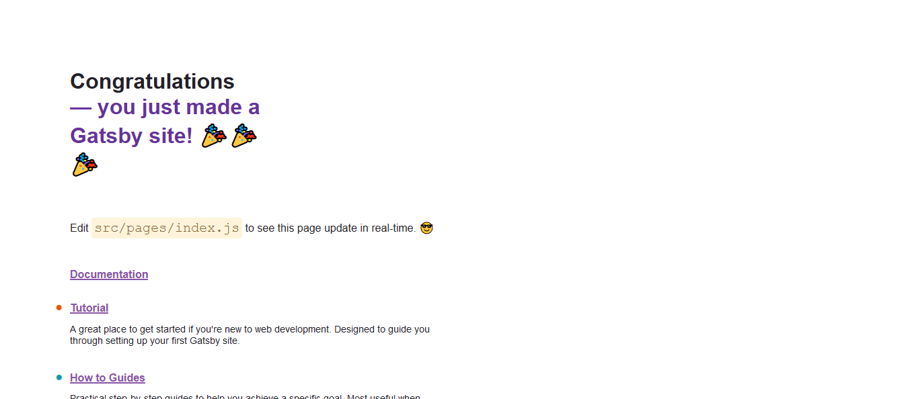
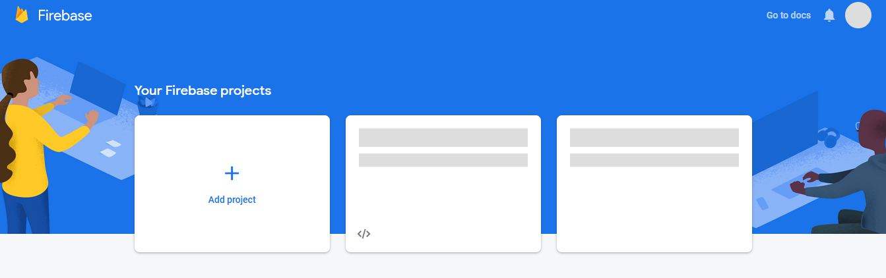
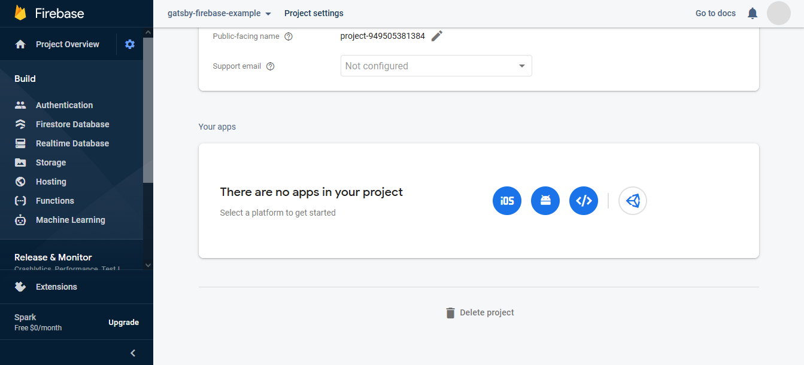
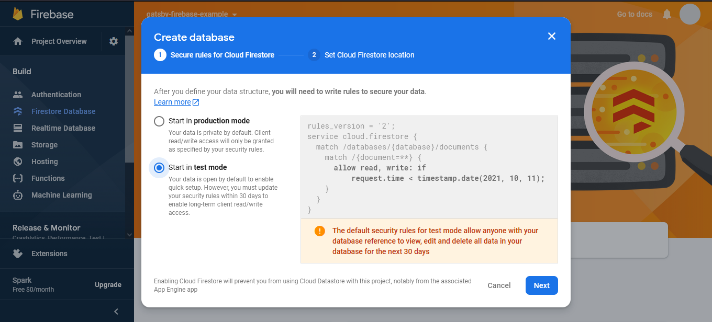
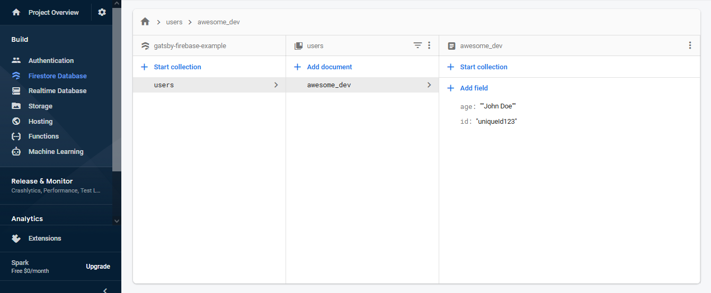
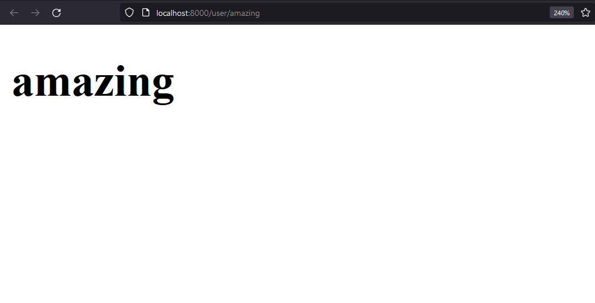
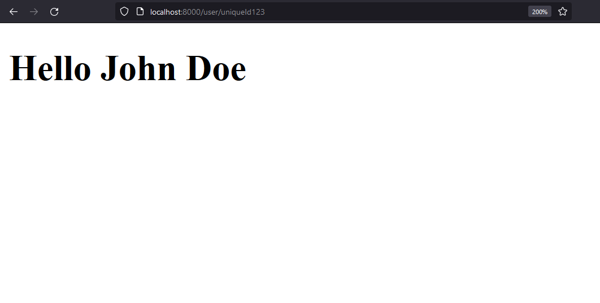

# Introducción

Mientras estaba trabajando en un proyecto de Gatsby, necesitaba una manera de registrar usuarios, guardar su información y crear un link personalizado desde el cual se pudiera leer sus datos, así que decidí utilizar la base de datos de Firebase para lograrlo.
Gatsby es un Generador de Sitios Estáticos para React, es decir que convierte los datos de fuentes externas a páginas basadas en HTML para evitar el procesamiento del lado del servidor cada vez que se quiera acceder a la página web.
Por otro lado, Firebase es una plataforma de desarrollo para aplicaciones web y móviles creada por Google. Tiene muchos productos, como Cloud Storage, Machine Learning y Hosting, pero nos vamos a enfocar en la base de datos de Firebase: Firestore. Según [Firebase](https://firebase.google.com/docs/firestore?hl=es), Firestore es “es una base de datos flexible y escalable para el desarrollo en servidores, dispositivos móviles y la Web desde Firebase y Google Cloud.”

## El Problema con Gatsby y Firebase

La mayoría de las veces, tú puedes añadir datos externos a tu página de Gatsby con un plugin de la [Libreria de Plugings de Gatsby](https://www.gatsbyjs.com/plugins), después generas los archivos estaticos, y despliegas tu página para ver los cambios realizados. Sin embargo, en mi caso, necesitaba crear páginas cada vez que un nuevo usuario se registraba. Se podría lograr esto al “escuchar” por un cambio en mi base de datos y después desplegar nuevamente mi página de Gatsby, pero como te puedes dar cuenta, eso sería problemático en términos de rendimiento, ya que preparar el despliegue y desplegar una y otra vez es computacionalmente costoso y una pérdida de tiempo

## ¿Qué se puede hacer?

Para lograr nuestras metas anteriores, vamos a utilizar la API [File System Route](https://www.gatsbyjs.com/docs/reference/routing/file-system-route-api/) de Gatsby para crear rutas sólo en el cliente, y acceder a la URL para obtener ciertos parametros los cuales nos permitiran cargar los datos del usuario desde Firestore.

# Al punto

## 1. Iniciar un nuevo proyecto Gatsby

Para comenzar, tenemos que inicializar un nuevo [proyecto de Gatsby](https://www.gatsbyjs.com/docs/quick-start/) con el siguiente comando

```sh
$ npm init gatsby
```

Luego, sigue las indicaciones para elegir tu CMS preferido, herramientas de estilo y funciones adicionales, y una vez que hayas terminado, ve al directorio recién creado.

```sh
$ cd my-gatsby-site
```

Por último, inicia el servidor de desarrollo local con el comando:

```sh
$ npm run develop
```

¡Excelente! Ahora puedes navegar a [localhost:8000](http://localhost:8000/user/amazing) y ver tu sitio.



## 2.Crea un proyecto de Firebase

El siguiente paso es [agregar un nuevo proyecto de Firebase](https://firebase.google.com/docs/web/setup) en la [Consola de Firebase](https://console.firebase.google.com/)



Después de hacer clic en "Agregar proyecto" y agregar un nombre, Firebase creará tu nuevo proyecto y te redireccionará a la descripción general del mismo. Allí puede acceder a la configuración del proyecto y registrar una nueva aplicación web.



Después de darle un nombre, Firebase te dará la configuración de tu aplicación, que se verá así:

```javascript
const firebaseConfig = {
	apiKey: "API_KEY",
	authDomain: "AUTH_DOMAIN.firebaseapp.com",
	projectId: "gatsby-firebase-example",
	storageBucket: "STORAGEBUCKET.appspot.com",
	messagingSenderId: "MESSAGING_SENDE_RID",
	appId: "APP:web:ID",
};
```

Luego, puedes [agregar Firestore](https://firebase.google.com/docs/firestore/quickstart) a tu proyecto en "Modo de prueba"



Para simplificar este tutorial, crearemos manualmente algunos datos en Firestore para leerlos más tarde desde Gatsby. Crearemos una colección llamada "users" y un documento llamado "awesome_dev" con un campo de "name" e "id":



De vuelta a tu código de Gatsby, instala Firebase en la raíz de tu proyecto:

```sh
$ npm install firebase@9.0.2 --save
```

## 3. Crear una ruta sólo para el cliente

Una vez que Firebase esté instalado, ve a tu directorio "./src/pages" y crea un directorio "/user" con un archivo dentro llamado "\[id].js". En Gatsby, los corchetes alrededor de la ruta de un archivo de página marcan cualquier segmento dinámico de la URL al que puedes acceder dentro de tus componentes.

Nota: después de crear un nuevo archivo de página, es posible que deba reiniciar el servidor de desarrollo.

Dentro del archivo "\[id].js", crea un componente simple con una propiedad de id:

```jsx
// ./src/pages/user/[id].js

import * as React from "react";

const UserPage = ({id}) => {
	return <h1>{id}</h1>;
};
export default UserPage;
```

Y si vas a [localhost:8000/user/amazing](http://localhost:8000/user/amazing) verás lo siguiente:



¡Ahora puede usar la ID del URL para acceder a los datos de Firestore!

## 4. Acceder a los datos de Firestore

En primer lugar, debes inicializar tu [Aplicación de Firebase](https://firebase.google.com/docs/web/setup#add-sdk-and-initialize) dentro de Gatsby:

```jsx
// ./src/pages/user/[id].js

import {initializeApp} from "firebase/app";

// Your web app's Firebase configuration
const firebaseConfig = {
	//...
};

// Initialize Firebase
const app = initializeApp(firebaseConfig);

const UserPage = ({id}) => {
	return <h1>{id}</h1>;
};

export default UserPage;
```

Nota: preferiblemente inicializarías tu aplicación dentro de un contexto de React y luego lo agregarías a tu función [wrapRootElement](https://www.gatsbyjs.com/docs/reference/config-files/gatsby-browser/#wrapRootElement) para ejecutarlo en todas tus páginas.

Luego, importa firestore desde firebase y crea una referencia a tu colección de usuarios:

```jsx
// ./src/pages/user/[id].js

import * as React from "react";
import {initializeApp} from "firebase/app";
import {getFirestore, collection} from "firebase/firestore";

// Your web app's Firebase configuration
const firebaseConfig = {
	//...
};

// Initialize Firebase
const app = initializeApp(firebaseConfig);

const UserPage = ({id}) => {
	const db = getFirestore();
	const usersRef = collection(db, "users");

	return <h1>{id}</h1>;
};

export default UserPage;
```

Ahora necesitamos crear una consulta para la colección de usuarios que busque un usuario con el mismo id que el id de la URL. Para lograr esto, importamos el módulo _query_ de Firestore con un par de funciones más. Luego ejecutaremos la consulta dentro de un _useEffect_.

```jsx
// ./src/pages/user/[id].js

import * as React from "react";
import {useEffect} from "react";
import {initializeApp} from "firebase/app";
import {getFirestore, collection, query, where, getDocs} from "firebase/firestore";

// Your web app's Firebase configuration
const firebaseConfig = {
	//...
};

// Initialize Firebase
const app = initializeApp(firebaseConfig);

const UserPage = ({id}) => {
	const db = getFirestore();
	const usersRef = collection(db, "users");

	useEffect(() => {
		const queryUser = async () => {
			const usersQuery = query(usersRef, where("id", "==", id));
			const usersQuerySnap = await getDocs(usersQuery);

			usersQuerySnap.forEach((user) => {});
		};

		queryUser();

		// eslint-disable-next-line react-hooks/exhaustive-deps
	}, []);

	return <h1>{id}</h1>;
};

export default UserPage;
```

Nota: debes iterar el resultado de la consulta, ya que normalmente este consulta varios documentos. Dado que la identificación es supuestamente única, solo traerá una.

¡Ahora puedes crear un estado de React que tendrá los datos del usuario y luego lo puedes renderizar condicionalmente en tu sitio web!

```jsx
// ./src/pages/user/[id].js

import * as React from "react";
import {useEffect, useState} from "react";
import {initializeApp} from "firebase/app";
import {getFirestore, collection, query, where, getDocs} from "firebase/firestore";

// Your web app's Firebase configuration
const firebaseConfig = {
    /...
};

// Initialize Firebase
const app = initializeApp(firebaseConfig);

const UserPage = ({id}) => {
    const [userData, setUserData] = useState(null);

    const db = getFirestore();
    const usersRef = collection(db, "users");

    useEffect(() => {
        const queryUser = async () => {
            const usersQuery = query(usersRef, where("id", "==", id));

            const usersQuerySnap = await getDocs(usersQuery);

            usersQuerySnap.forEach((user) => {
                setUserData(user.data());
            });
        };

        queryUser();

        // eslint-disable-next-line react-hooks/exhaustive-deps
    }, []);

    return <div>{userData ?
        <h1>Hello {userData.name}</h1> :
        <h1>Loading...</h1>}</div>;
};

export default UserPage;
```

¡Ta-da! Ahora, si vamos a[ localhost:8000/user/uniqueId123](http://localhost:8000/user/uniqueId123) veremos el nombre de awesome_dev aparecer en la pantalla.



# Conclusión

Espero que puedas encontrar este enfoque tan útil como lo fue para mí. Como puedes ver, es bastante sencillo y legible, por lo que puedes concentrarte más en el contenido de tu aplicación y no en los frustrantes detalles técnicos. ¡Hasta la próxima vez!
