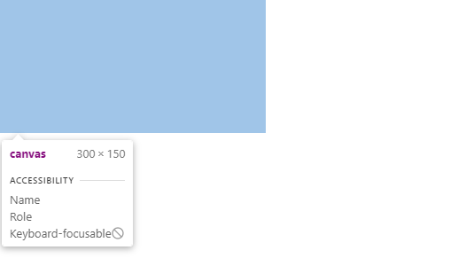

# Introduction

Normally, when using vanilla Javascript to manipulate a canvas element, you would have to get an [HTMLElement](https://developer.mozilla.org/en-US/docs/Web/API/HTMLElement) reference of the canvas element in the DOM, then call [HTMLCanvasElement.getContext()](https://developer.mozilla.org/en-US/docs/Web/API/HTMLCanvasElement/getContext) to get a drawing context and start drawing onto the canvas. However, in React, you use JSX to manipulate the DOM, and when you need access to an HTMLElement reference, you can simply use the useRef hook. However, it can be tricky to know where to call useRef() and getContext(), so they just get called when needed and therefore avoid unnecessary calculations on every render.

# The Gist

## 1. Create a React App

Create a new React app and once all packages are installed, change the directory to it. 

```shell
 npx create-react-app canvas
```

```powershell
cd canvas
```

Finally, you can run the start command and see a new project on [localhost:3000](http://localhost:3000/)

```shell
 npm run start
```


### Small tip

After installing the `create-react-app` dependencies, I got the following npm audit security warning, regardless I just initialized the app. 

```powershell
27 vulnerabilities (16 moderate, 9 high, 2 critical)
```

Even though [npm audit isn't the best tool](https://overreacted.io/npm-audit-broken-by-design/) to check for security risks, if you don't want to see the warning, you can  move `react-scripts` from `dependencies` to `devDependencies` in `package.json`. However, `npm audit` still warns for development dependencies by default, so you will have to run `npm audit --production` to not see the warnings.

```json
// canvas/package.json
	"dependencies": {
		"@testing-library/jest-dom": "^5.15.0",
		"@testing-library/react": "^11.2.7",
		"@testing-library/user-event": "^12.8.3",
		"react": "^17.0.2",
		"react-dom": "^17.0.2",
        "web-vitals": "^1.1.2",
	},
	"devDependencies": {
		"react-scripts": "4.0.3"
	},
```

## 2. Create and Reference the Canvas Element

Once everything is ready, you can open the `src/App.js` file and delete all the boilerplate to left just a functional component and add a canvas element inside. Then import the `useRef` hook from `react` and create a reference to the canvas through the ref attribute.

```jsx
// canvas/src/App.js

import {useRef} from "react";

function App() {

	const canvasRef = useRef(null);

	return (
		<div>
			<canvas ref={canvasRef}></canvas>
		</div>
	);
}

export default App;
```

### Note

We pass `null` as the first argument of `useRef` to use it as the initial value of `canvasRef`, which is the variable that will store the canvas HTMLElement.  

## 3. Create a Context

You can create a drawing context that is globally available in the component by calling `getContext` at the top level of the function. The "2d" parameter of `getContext` defines the context type of the canvas, which can be 2d and 3d.

```jsx
// canvas/src/App.js

import {useRef} from "react";

function App() {

	const canvasRef = useRef(null);

	const canvas = canvasRef.current;
	const context = canvas.getContext("2d");


	return (
		<div>
			<canvas ref={canvasRef}></canvas>
		</div>
	);
}

export default App;
```

### Note

The `HTMLCanvasReference` isn't stored directly on the `canvasRef` variable, but in its only property called .`current`

However, this implementation isn't the most appropiate, since every time the component re-renders, `getContext` would get called. Although, according to the [MDN](https://developer.mozilla.org/en-US/docs/Web/API/HTMLCanvasElement/getContext),

> Later calls to the `getContext`method on the same canvas element, with the same `contextType` argument, will always return the same drawing context instance as was returned the first time the method was invoked. It is not possible to get a different drawing context object on a given canvas element

So you don't have to worry about your app breaking due to calling several times the `getContext` method. However, you should avoid unnecesary calculations by using the `useEffect` hook and creating the context inside. It is valuable to notice that we don't have to add the `canvasRef` variable to useEffect's dependency array, since mutating a ref doesn't trigger a re-render or a useEffect call, so we left it empty thus it only gets called once.

```jsx
// canvas/src/App.js

import {useRef, useEffect} from "react";

function App() {
	const canvasRef = useRef(null);

	useEffect(() => {
		const canvas = canvasRef.current;
		const context = canvas.getContext("2d");
	}, []);

	return (
		<div>
			<canvas ref={canvasRef}></canvas>
		</div>
	);
}

export default App;
```

Although, now the context isn't globally available to the component; it only exists inside the `useEffect`, so to fix that you would have to create a global state with `useState` and a `null` initial value. Then inside the `useEffect`, assign the context to the state.  

```jsx
// canvas/src/App.js

import {useRef, useState, useEffect} from "react";

function App() {
	const [canvasContext, setCanvasContext] = useState(null);

	const canvasRef = useRef(null);

	useEffect(() => {
		const canvas = canvasRef.current;
		const context = canvas.getContext("2d");
		setCanvasContext(context);
	}, []);

	return (
		<div>
			<canvas ref={canvasRef}></canvas>
		</div>
	);
}

export default App;
```

## 4. Draw something!

Finally, we will manipulate the canvas context and canvas element by resizing the canvas to the window size, changing the background color every time the user clicks on the canvas.

If you inspect the canvas element with the dev tools, you will see that the canvas is a small rectangle at the page corner. 



 To resize it, you can access the `window` object to get its width and height properties and then use `canvasRef.current` to change the canvas element size. 

```jsx
// canvas/src/App.js

import {useRef, useState, useEffect} from "react";

function App() {
	const [canvasContext, setCanvasContext] = useState(null);

	const canvasRef = useRef(null);

	useEffect(() => {
		const windowWidth = window.innerWidth;
		const windowHeight = window.innerHeight;

		const canvas = canvasRef.current;

		canvas.width = windowWidth;
		canvas.height = windowHeight;

		const context = canvas.getContext("2d");
		setCanvasContext(context);
	}, [canvasRef]);

	return (
		<div>
			<canvas ref={canvasRef}></canvas>
		</div>
	);
}

export default App;
```

To finish, you can use the context variable to manipulate the canvas content inside the `onClick` canvas' attribute. You can use the `context.fillStyle` method to change the color of the rectangle, and then use the `context.fillRect` method to actually draw the rectangle. `context.fillRect` takes 4 arguments, the two first are the starting x and y coordinates (which will be 0,0), and the last two are the finish point (which will be the canvas width and height).

```jsx
// canvas/src/App.js

//....
	return (
		<div>
			<canvas
				ref={canvasRef}
				onClick={() => {
					canvasContext.fillStyle = "red";
					canvasContext.fillRect(0, 0, canvasContext.canvas.width, canvasContext.canvas.height);
				}}></canvas>
		</div>
	);
//....
```

Now if you click the canvas element, it will change from white to red. Now, you can add an array with color names and use [Math.random](https://developer.mozilla.org/es/docs/Web/JavaScript/Reference/Global_Objects/Math/random) to get a random color every time there is a click.

```jsx
// canvas/src/App.js

import {useRef, useState, useEffect} from "react";

const colors = ["red", "green", "blue", "yellow", "purple", "orange", "black", "white", "brown"];

const getRandomColor = () => {
	const randomIndex = Math.floor(Math.random() * colors.length);
	return colors[randomIndex];
};

function App() {
	const [canvasContext, setCanvasContext] = useState(null);

	const canvasRef = useRef(null);

	useEffect(() => {
		const windowWidth = window.innerWidth;
		const windowHeight = window.innerHeight;

		const canvas = canvasRef.current;

		canvas.width = windowWidth;
		canvas.height = windowHeight;

		const context = canvas.getContext("2d");
		setCanvasContext(context);
	}, [canvasRef]);

	return (
		<div>
			<canvas
				ref={canvasRef}
				onClick={() => {
					canvasContext.fillStyle = getRandomColor();
					canvasContext.fillRect(0, 0, canvasContext.canvas.width, canvasContext.canvas.height);
				}}></canvas>
		</div>
	);
}

export default App;

```

### Note

`Math.random` returns a random value between 0 to 1, so we had to multiply it times the colors array length.

### Result


# Conclusion

As you can see, now you can use the drawing context across the component. It is worth noticing that if you need to use the canvas HTMLElement reference, you can globally use the `canvasRef.current` property, or the read-only [`canvasContext.canvas`](https://developer.mozilla.org/en-US/docs/Web/API/CanvasRenderingContext2D/canvas)`.`  I hope you find this approach easy and readable, as well as performant. Until the next time!