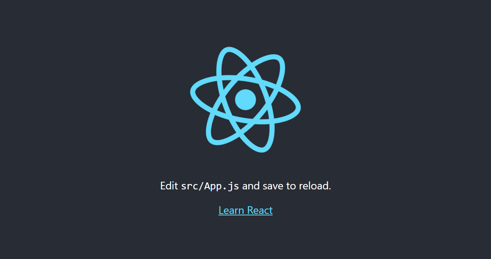

# Introducción

Normalmente, cuando usamos vanilla Javascript para manipular el elemento de canvas, tendríamos que obtener una referencia del [`HTMLElement`](https://developer.mozilla.org/en-US/docs/Web/API/HTMLElement)del canvas en el DOM, y después ejecutar [`HTMLCanvasElement.getContext()`](https://developer.mozilla.org/en-US/docs/Web/API/HTMLCanvasElement/getContext) para obtener un contexto de dibujo y así empezar a usar el canvas. Sin embargo, en React, utilizamos JSX para manipular el DOM, y cuando necesitamos acceso a la referencia `HTMLElement` , tú simplemente utilizas el hook `useRef` de React. No obstante, puede ser confuso saber donde llamar a `useRef` y `getContext` de tal manera que solo sean ejecutados cuando sea necesario, y así evitar cálculos innecesarios en cada renderizado. 

# Al Punto

## 1. Crear una nueva app de React

Crea una nueva app de React, y una vez que todos los paquetes se instalen, cambia el directo a la carpeta recién creada

```shell
 npx create-react-app canvas
```

```powershell
cd canvas
```

Finalmente, puedes ejecutar el comando de inicio y verás un nuevo proyecto en [localhost:3000](http://localhost:3000/)

```shell
 npm run start
```



### Pequeño consejo

Después de instalar las dependencias de `create-react-app`, obtuve la siguiente advertencia de npm audit, a pesar de que acabo de inicializar la app.

```powershell
27 vulnerabilities (16 moderate, 9 high, 2 critical)
```

Aunque [npm audit no es la mejor herramienta](https://overreacted.io/npm-audit-broken-by-design/) para examinar riesgos en la seguridad de tu app, si no quieres ver la advertencia, puedes mover `react-scripts` de `dependencies` a `devDependencies` en `package.json`. No obstante,  `npm audit` aún te advierte por vulnerabilidades en las dependencias de desarrollo, por lo que tendrás que ejecutar `npm audit --production` para no ver la advertencia.

```json
// canvas/package.json

	"dependencies": {
		"@testing-library/jest-dom": "^5.15.0",
		"@testing-library/react": "^11.2.7",
		"@testing-library/user-event": "^12.8.3",
		"react": "^17.0.2",
		"react-dom": "^17.0.2",
        "web-vitals": "^1.1.2",
	},
	"devDependencies": {
		"react-scripts": "4.0.3"
	},
```

## 2. Crea y referencia el elemento de Canvas

Una vez que todo este listo, puedes abrir el archivo `src/App.js` y borrar todo el código de muestra, dejando solamente un componente funcional. Posteriormente, añade un elemento de canvas dentro, importa el hook de `useRef` de `react`, y crea una referencia al canvas a través del atributo `ref`. 

```jsx
// canvas/src/App.js

import {useRef} from "react";

function App() {

	const canvasRef = useRef(null);

	return (
		<div>
			<canvas ref={canvasRef}></canvas>
		</div>
	);
}

export default App;
```

### Nota

Pasamos `null` como el primero argumento de `useRef` para utilizarlo como el valor inicial de `canvasRef`, que es la variable que almacenará el `HTMLElement` del canvas.

## 3. Crea un contexto

Puedes crear un contexto de dibujo que este globalmente disponible en el componente al llamar `getContext` al inicio de la función.. Después pasamos "2d" como el primer parámetro de  `getContext`  ya que define el tipo de contexto del canvas, el cual puede estar en dos o tres dimensiones.

```jsx
// canvas/src/App.js

import {useRef} from "react";

function App() {

	const canvasRef = useRef(null);

	const canvas = canvasRef.current;
	const context = canvas.getContext("2d");


	return (
		<div>
			<canvas ref={canvasRef}></canvas>
		</div>
	);
}

export default App;
```

### Nota

La referencia del canvas no es almacenado directamente en el `canvasRef`, sino en su única propiedad llamada `.current`.

Sin embargo, **esta implementación no es la más apropiada**, ya que cada vez que el compone sea renderizado, `getContext` será llamada. No obstante, de acuerdo a la [MDN](https://developer.mozilla.org/en-US/docs/Web/API/HTMLCanvasElement/getContext),

> Ejecuciones posteriores del método `getContext` del mismo elemento canvas, con el mismo argumento de tipo de contexto, siempre devolverán el mismo contexto de dibujo como fue devuelto cuando el método fue invocado por primera vez. No es posible obtener otro contexto de dibujo de un mismo elemento canvas.

Por lo que no te tienes que preocupar por app rompiéndose por llamar varias veces al método `getContext`. No obstante, deberías evitar cálculos innecesarios al crear el contexto dentro del hook `useEffect`. Vale la pena decir que no tenemos que añadir `canvasRef`  dentro del arreglo de dependencias de `useEffect`, ya que mutar una referencia no provoca una nueva renderización, así que dejamos el arreglo vacío, y por ende sólo se ejecuta una vez.

```jsx
// canvas/src/App.js

import {useRef, useEffect} from "react";

function App() {
	const canvasRef = useRef(null);

	useEffect(() => {
		const canvas = canvasRef.current;
		const context = canvas.getContext("2d");
	}, []);

	return (
		<div>
			<canvas ref={canvasRef}></canvas>
		</div>
	);
}

export default App;
```

No obstante, ahora el contexto no está globalmente disponible; solamente existe en el interior de `useEffect`, así que para arreglarlo tendrás que crear un estado global con el hook `useState` y con `null` como su valor inicial. Después, dentro de `useEffect`, asignar el contexto a dicho estado.

```jsx
// canvas/src/App.js

import {useRef, useState, useEffect} from "react";

function App() {
	const [canvasContext, setCanvasContext] = useState(null);

	const canvasRef = useRef(null);

	useEffect(() => {
		const canvas = canvasRef.current;
		const context = canvas.getContext("2d");
		setCanvasContext(context);
	}, []);

	return (
		<div>
			<canvas ref={canvasRef}></canvas>
		</div>
	);
}

export default App;
```

## 4. Dibuja algo!

Finalmente, manipularemos el contexto y el elemento canvas al redimensionar el canvas al tamaño de la ventana y cambiar el color del fondo cada vez que el usuario haga click en el canvas.

Si inspeccionas el elemento canvas con las *dev tools*, verás que el canvas es sólo un pequeño rectángulo en una esquina. 


Para redimensionarlo, puedes acceder a la propiedad del objeto `window` para obtener sus propiedades de grosor y largo, y después utilizar `canvasRef.current` para cambiar el tamaño del canvas.  

```jsx
// canvas/src/App.js

import {useRef, useState, useEffect} from "react";

function App() {
	const [canvasContext, setCanvasContext] = useState(null);

	const canvasRef = useRef(null);

	useEffect(() => {
		const windowWidth = window.innerWidth;
		const windowHeight = window.innerHeight;

		const canvas = canvasRef.current;

		canvas.width = windowWidth;
		canvas.height = windowHeight;

		const context = canvas.getContext("2d");
		setCanvasContext(context);
	}, [canvasRef]);

	return (
		<div>
			<canvas ref={canvasRef}></canvas>
		</div>
	);
}

export default App;
```

Para finalizar, puedes utilizar el contexto para manipular el contenido del canvas dentro su atributo `onClick`. Ahí, puedes usar el método `context.fillStyle` para cambiar el color del rectángulo, y después utilizar el método `context.fillRect` para dibujar el rectángulo en sí. `context.fillRect` toma 4 argumentos, los dos primeros son las coordenadas iniciales x, y (que serán 0,0) y los dos últimos son las coordenadas finales (que serán el grosor y altura del canvas).

```jsx
// canvas/src/App.js

//....
	return (
		<div>
			<canvas
				ref={canvasRef}
				onClick={() => {
					canvasContext.fillStyle = "red";
					canvasContext.fillRect(0, 0, canvasContext.canvas.width, canvasContext.canvas.height);
				}}></canvas>
		</div>
	);
//....
```

Ahora si haces click en el elemento de canvas, verás que va cambiar de blanco a rojo. Ahora puedes añadir un arreglo con los nombres de colores, y utilizar [Math.random](https://developer.mozilla.org/es/docs/Web/JavaScript/Reference/Global_Objects/Math/random) para seleccionar aleatoriamente un elemento cada vez que hay un click

```jsx
// canvas/src/App.js

import {useRef, useState, useEffect} from "react";

const colores = ["red", "green", "blue", "yellow", "purple", "orange", "black", "white", "brown"];

const getRandomColor = () => {
	const randomIndex = Math.floor(Math.random() * colores.length);
	return colores[randomIndex];
};

function App() {
	const [canvasContext, setCanvasContext] = useState(null);

	const canvasRef = useRef(null);

	useEffect(() => {
		const windowWidth = window.innerWidth;
		const windowHeight = window.innerHeight;

		const canvas = canvasRef.current;

		canvas.width = windowWidth;
		canvas.height = windowHeight;

		const context = canvas.getContext("2d");
		setCanvasContext(context);
	}, [canvasRef]);

	return (
		<div>
			<canvas
				ref={canvasRef}
				onClick={() => {
					canvasContext.fillStyle = getRandomColor();
					canvasContext.fillRect(0, 0, canvasContext.canvas.width, canvasContext.canvas.height);
				}}></canvas>
		</div>
	);
}

export default App;
```

### Nota

`Math.random` devuelve un valor aleatorio entre 0 y 1, por lo que lo multiplicamos por el largo del arreglo de colores.

### Resultado


# Conclusión

Como puedes ver, ahora puedes utilizar el contexto en todo el componente. Vale la pena recalcar que si necesitas utilizar la referencia al HTMLElement del contexto, puedes utilizar globalmente la propiedad `canvasRef.current`, o la propiedad de solo lectura [`canvasContext.canvas`](https://developer.mozilla.org/en-US/docs/Web/API/CanvasRenderingContext2D/canvas). Espero que encuentres esta enfoque fácil y leíble, además que eficiente. Hasta la próxima!